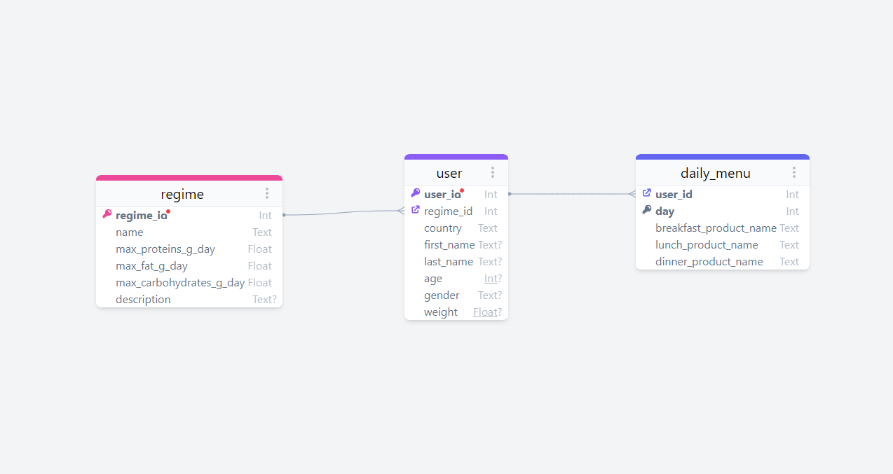
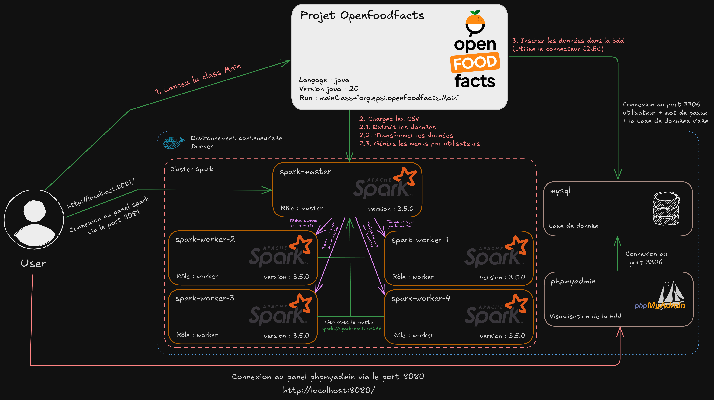
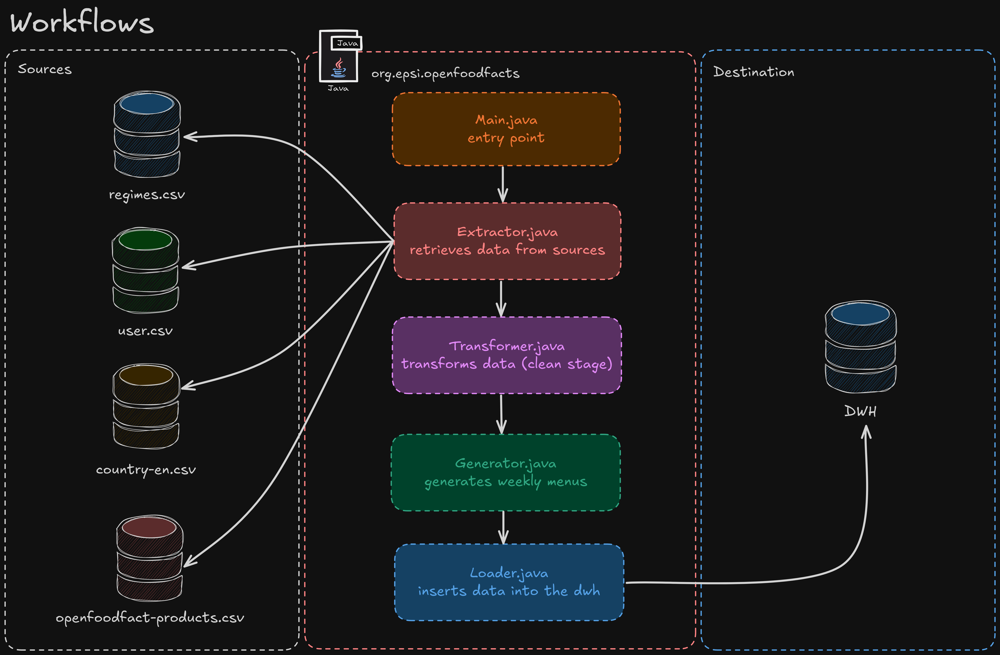

<div align="center">
  
</div>


# 🍽️ Projet ETL Openfoodfacts

Ce projet consiste à mettre en place une solution ETL (Extract, Transform, Load) distribuée pour générer aléatoirement des menus alimentaires adaptés aux besoins des utilisateurs, en utilisant les données disponibles sur OpenFoodFacts.

## 📝 Description du Projet

Le client a exprimé le besoin de créer un système capable de générer des menus alimentaires équilibrés sur une semaine, conformément aux régimes alimentaires sélectionnés par les utilisateurs. Les menus doivent respecter les seuils nutritionnels spécifiques à chaque régime, tout en tenant compte des critères tels que les lipides, les glucides, le sodium, etc.

## 🎯 Objectifs

1. Collecter les données depuis OpenFoodFacts. 
2. Créer des sources de données supplémentaires pour les régimes alimentaires et les utilisateurs. 
3. Assurer la qualité des données en appliquant des critères de sélection. 
4. Transformer les données pour générer des menus alimentaires équilibrés en fonction des régimes alimentaires des utilisateurs. 
5. Charger les menus générés dans un Data Warehouse (DWH).

## 🛠️ Spécificités Techniques

- **Langage de programmation :** Java
- **Outils ETL :** Apache Spark
- **Source des données :** OpenFoodFacts (https://fr.openfoodfacts.org/data)
- **Bases de données :** MySQL (pour le DWH)

## 📋 Prérequis
Pour pouvoir exécuter ce projet, vous devez avoir installé les logiciels suivants :
- [Docker](https://www.docker.com/)
- [Java 20](https://www.oracle.com/java/technologies/javase/jdk20-archive-downloads.html)

## 🚀 Installation

1. **Cloner le projet :**
```bash
git clone https://github.com/Foufou-exe/openfoodfacts-etl.git
```

2. **Ouvrir le projet dans un IDE (IntelliJ IDEA, Eclipse, etc.) :**
```bash
cd openfoodfacts-etl
```

3. **Télécharger le CSV d'OpenFoodFacts et le placer dans le dossier** `data/` **avec les autres fichiers CSV. Vous pouvez télécharger le fichier CSV depuis ce lien :** [**OpenFoodFacts**](https://static.openfoodfacts.org/data/en.openfoodfacts.org.products.csv)
```bash
mv mv en.openfoodfacts.org.products.csv data/
```

4. **Installation des dépendances Maven si ce n'est pas déjà fait :** (*voir le fichier `pom.xml` pour plus de détails.*)
```bash
mvn install
```

5. **Lancez le conteneur MySQL :**
```bash
docker-compose up -d
```

6. **Vérifiez que le conteneur MySQL est en cours d'exécution :**
```bash
docker ps
```

7. **Exécutez la classe principale `Main.java` pour lancer le projet :**
```bash
mvn exec:java -Dexec.mainClass="org.epsi.openfoodfacts.Main"
```

Ou si vous souhaitez compiler le projet avant de l'exécuter :

```bash
mvn clean compile exec:java -Dexec.mainClass="org.epsi.openfoodfacts.Main"
```

## 📦 Structure du Projet

```
openfoodfacts-etl
│
├── README.md // Fichier README (en anglais)
├── README.fr.md // Fichier README (en français)
├── LICENSE // Licence du projet
├── pom.xml // Fichier de configuration Maven
├── docker-compose.yml // Fichier Docker Compose
├── data
│   ├── en.openfoodfacts.org.products.csv // Fichier CSV OpenFoodFacts à télécharger
│   ├── regimes.csv // Fichier CSV des régimes alimentaires 
│   └── users.csv // Fichier CSV des utilisateurs
│
├── src
│   └── main
│       ├── java
│       │   └── org.epsi.openfoodfacts
│       │       ├── Constants.java // Constantes du projet
│       │       ├── Main.java // Classe principale du projet
│       │       ├── Extrator.java // Extraction des données
│       │       ├── Transformer.java // Transformation des données
│       │       ├── Generator.java // Génération des menus
│       │       ├── Utils.java // Méthodes utilitaires
│       │       └── Loader.java // Chargement des données
│       │
│       └── resources
│       
└── docs
    ├── database
    │    └── init.sql // Script d'initialisation de la base de données
    ├── diagram
    │    ├── diagram-openfoodfacts.png // Diagramme de l'architecture du projet
    │    ├── diagram-openfoodfacts.azimutt.json // Fichier Azimutt du diagramme
    │    ├── README.fr.md // Instructions pour générer le diagramme (en français)
    │    └── README.md // Instructions pour générer le diagramme (en anglais)
    ├── schemas
    │    ├── schema-openfoodfacts.png // Schéma de du projet
    │    └── workflows-openfoodfacts.png // Workflows du projet
    ├── subject
    │    └── Exercice_Atelier_Intégration_des_Données.pdf // Sujet du projet
    └── images
         ├── logo-openfoodfact.png // Logo du projet
         └── banner-openfoodfact.png // Bannière du projet
```

## 📄 Documentation

Pour plus d'informations sur le projet, veuillez consulter la documentation disponible dans le dossier `docs/`.
Voir ci-dessous les différentes parties de la documentation :


<details>
  <summary>
    📚 Diagramme MCD (Modèle Conceptuel de Données)
  </summary>

  

</details>

<details>
  <summary>
    📚 Schéma du Projet
  </summary>



</details>

<details>
  <summary>
    📚 Workflows du Projet
  </summary>



</details>

## 📌 Auteur
- [**Thibaut Maurras**](https://github.com/Foufou-exe)
- [**Akkhaladeth SOULISOMPHOU**]()

## 📜 License
Ce projet est sous licence MIT - voir le fichier [LICENSE](./LICENSE) pour plus de détails.