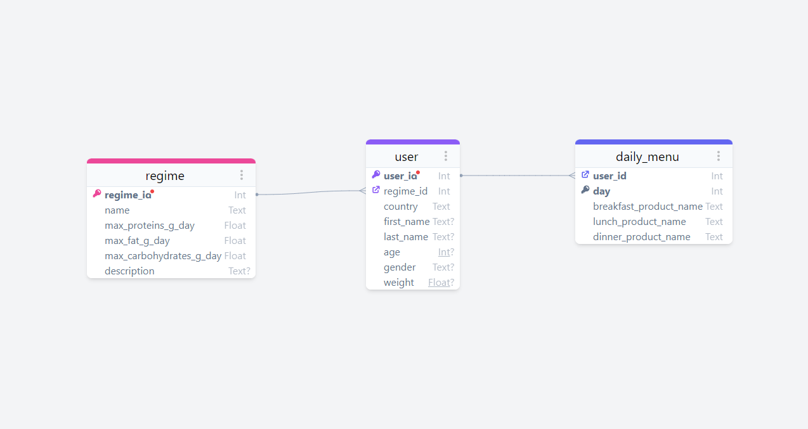
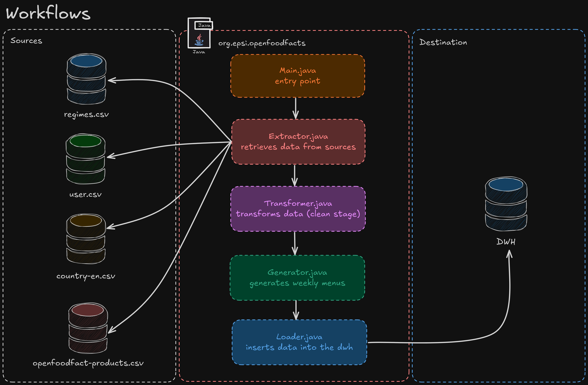

<div align="center">
  


[](https://opensource.org/licenses/MIT)
[]()
[]()
[]()
[]()
[]()
</div>

<div align="center">

[🇫🇷 Français](./README.fr.md) | [🇬🇧 English](./README.md)

</div>


# 🍽️ Openfoodfacts ETL Project

This project aims to set up a distributed ETL (Extract, Transform, Load) solution to randomly generate food menus tailored to users' needs, using data available on OpenFoodFacts.

## 📝 Project Description

The client has expressed the need to create a system capable of generating balanced food menus for a week, according to the dietary regimes selected by the users. The menus must meet the specific nutritional thresholds for each diet, considering criteria such as lipids, carbohydrates, sodium, etc.

## 🎯 Objectives

1. Collect data from OpenFoodFacts.
2. Create additional data sources for dietary regimes and users.
3. Ensure data quality by applying selection criteria.
4. Transform the data to generate balanced food menus based on users' dietary regimes.
5. Load the generated menus into a Data Warehouse (DWH).

## 🛠️ Technical Specifications

- **Programming Language:** Java
- **ETL Tools:** Apache Spark
- **Data Source:** OpenFoodFacts (https://world.openfoodfacts.org/data)
- **Databases:** MySQL (for the DWH)

## 📋 Prerequisites

To run this project, you need to have the following software installed:
- [Docker](https://www.docker.com/)
- [Java 20](https://www.oracle.com/java/technologies/javase/jdk20-archive-downloads.html)

## 🚀 Installation

1. **Clone the project:**
```bash
git clone https://github.com/Foufou-exe/openfoodfacts-etl.git
```

2. **Open the project in an IDE (IntelliJ IDEA, Eclipse, etc.):**
```bash
cd openfoodfacts-etl
```

3. **Download the OpenFoodFacts CSV and place it in the** `data/` **folder with the other CSV files. You can download the CSV file from this link:** [**OpenFoodFacts**](https://static.openfoodfacts.org/data/en.openfoodfacts.org.products.csv)
```bash
mv en.openfoodfacts.org.products.csv data/
```

4. **Install Maven dependencies if not already done:** (*see the `pom.xml` file for more details.*)
```bash
mvn install
```

5. **Start the MySQL container:**
```bash
docker-compose up -d
```

6. **Check that the MySQL container is running:**
```bash
docker ps
```

7. **Run the main class `Main.java` to launch the project:**
```bash
mvn exec:java -Dexec.mainClass="org.epsi.openfoodfacts.Main"
```

Or if you want to compile the project before running it:

```bash
mvn clean compile exec:java -Dexec.mainClass="org.epsi.openfoodfacts.Main"
```

## 📦 Project Structure

```
openfoodfacts-etl
│
├── README.md // README file (in English)
├── README.fr.md // README file (in French)
├── LICENSE // Project license
├── pom.xml // Maven configuration file
├── docker-compose.yml // Docker Compose file
├── data
│   ├── en.openfoodfacts.org.products.csv // OpenFoodFacts CSV file to download
│   ├── regimes.csv // CSV file for dietary regimes
│   └── users.csv // CSV file for users
│
├── src
│   └── main
│       ├── java
│       │   └── org.epsi.openfoodfacts
│       │       ├── Constants.java // Project constants
│       │       ├── Main.java // Main project class
│       │       ├── Extrator.java // Data extraction
│       │       ├── Transformer.java // Data transformation
│       │       ├── Generator.java // Menu generation
│       │       ├── Utils.java // Utility methods
│       │       └── Loader.java // Data loading
│       │
│       └── resources
│       
└── docs
    ├── database
    │    └── init.sql // Database initialization script
    ├── diagram
    │    ├── diagram-openfoodfacts.png // Project architecture diagram
    │    ├── diagram-openfoodfacts.azimutt.json // Azimutt file of the diagram
    │    ├── README.fr.md // Instructions to generate the diagram (in French)
    │    └── README.md // Instructions to generate the diagram (in English)
    ├── schemas
    │    ├── schema-openfoodfacts.png // Project schema
    │    └── workflows-openfoodfacts.png // Project workflows
    ├── subject
    │    └── Exercice_Atelier_Intégration_des_Données.pdf // Project subject
    └── images
         ├── logo-openfoodfact.png // Project logo
         └── banner-openfoodfact.png // Project banner
```

## 📄 Documentation
For more information about the project, please refer to the documentation available in the docs/ folder. See below the different parts of the documentation:  

<details>
    <summary> 📚 Conceptual Data Model (CDM) Diagram </summary> 
      
</details> 

<details>
    <summary> 📚 Project Schema </summary>
    
</details>

<details>
    <summary> 📚 Project Workflows </summary>
    
</details>

## 📌 Author
- Thibaut Maurras
- Akkhaladeth SOULISOMPHOU

## 📜 License

This project is licensed under the MIT License - see the [LICENSE](LICENSE) file for details.